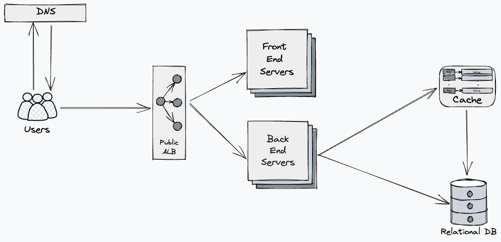

# URL Shortener

## Overview
The URL Shortener is a URL shortening application designed to convert longer URLs into concise, unique keys. 
This service provides the capability to use the unique key to access the original URL seamlessly.

## Key Features
- **URL Compression**: The application accepts a standard URL and generates a unique key representing the corresponding URL.
- **Link Redirection**: The users are equipped with the convenience of accessing the original website via the unique key provided to them.
- **CRUD Operations**: The users can manage their links through the creation, reading, updating, and deletion of a link.
- **No Auth**: A users links are based on a session token, this keeps the service simple

## System description
The system is composed of three components:

1. **Front End Server**: Provides the client with HTML, JavaScript, and CSS.
2. **Back End Server**: Serves as a REST API for administering shortened links.
3. **Relational Database**: Stores keys that correspond to a specific URL.
   
In addition, the system is supplemented with side components intended to aid its scalability and performance:

1. **Load Balancer**: Manages the front-end and back end servers to scale in accordance with incoming requests.
2. **[Redis](https://redis.io/) Instance**: Alleviates read load on the database by caching the values of queries.

## System Design

## Backend Server
The back end server will be a [Golang](https://go.dev/) service using the [Gin](https://gin-gonic.com/) framework and
the [GORM](https://gorm.io/) object relation mapper. To act as a REST API for the front end to mannage URL/key pairs 
based on user actions.

## Frontend Server
The front end will be a [NGINX](https://docs.nginx.com/nginx/admin-guide/web-server/web-server/) webserver 
serving static HTML, CSS and Javascript. The frontend will be build using Typescript and the [React](https://react.dev/) library.

## Scenarios

### Creating a link

### Read a link

### Update a link 

### Delete a link
